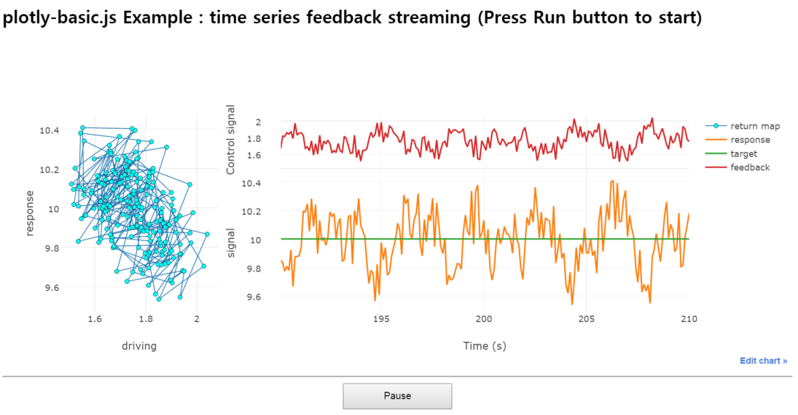
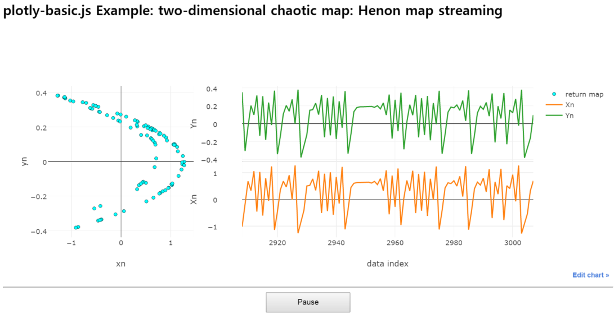

plotly-basic.js 2-dimensional streaming Example
===============================================

## Snapshots of 2-dimensional streaming

 

***

For more figures, please look into the folder 'PPG-snapshots'.

***

Go to : [Streaming pulse wave from Easy Pulse sensor](../README.md)

Go to : [Streaming temperature and humidity from DHT11 sensor](../README_dht11.md)
