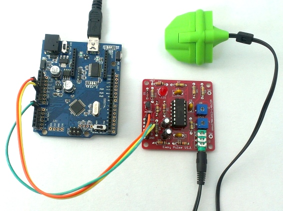
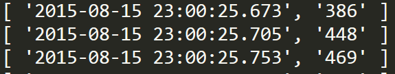
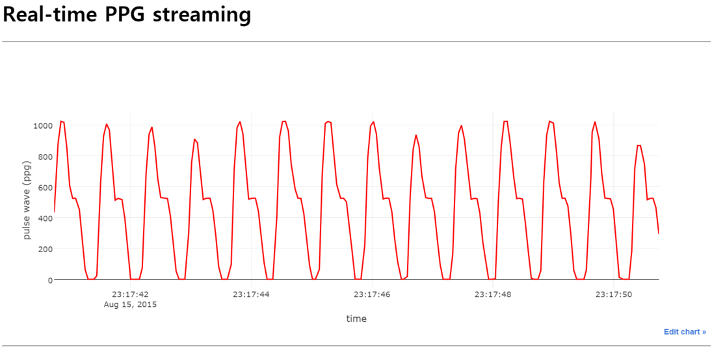

Arduino-nodejs-plotly-streaming
===============================

## Use Node.js to monitor Arduino-Easy Pulse sensor circuit on web browser.

This repo introduces a simple and efficient way to plot the streaming data from Easy Pulse ppg sensor wired with Arduino.

In the server side with node.js, data generated through serial port flow into the client side via server socket.

In the client side, the streaming data are continuously received via client socket. By using **plotly-basic.js** we can easily plot the streaming data in real time.

# The three steps to real time streaming
- Arduino-Easy Pulse sensor circuit and code
- Node server code using modules; serialport, socket.io
- Web client using plotly-basic.js and socket.io.js

## [1] Arduino-Easy Pulse sensor circuit

Wiring between Arduino and Easy Pulse sensor is very simple. 

| Arduino | Easy Pulse sensor |
| ------- | ----------------- |
| 5V | VCC |
| GND | GND |
| A0 | A0 |

---

 

Figure from [Embedded Lab](http://embedded-lab.com/blog/?p=7485)

Arduino code is also simple enough. The sampling frequency of pulse wave is 25 Hz when the delay is set to be 40 ms.

[code: SendPPGSignal.ino]
```ino
 #define PPG_INPUT 0

void setup() {
  Serial.begin(9600); // 9600, 115200
}

void loop() {
  int sensorValue = analogRead(PPG_INPUT); // A0

  Serial.println(sensorValue);
  delay(50); // fs = 20 Hz (delay(5) -> fs = 200 Hz ) 
}
```


## [2] Node server

Node.js code (data_ppg.js) uses two npm modules, serialport and socket.io that are defined in package.json. Each PPG signal is sent to web clients with a nicely formatted date string generated by using a helper function provided by Plotly.

[Running node server]

1. Install npm modules: `npm install`
2. Run node code: `node data_ppg.js`

[code: data_ppg.js]
``` js
var serialport = require('serialport');
var portName = 'COM3';  // change portName to that of your current port

var io = require('socket.io').listen(8000); // server listens for socket.io communication at port 8000


var sp = new serialport.SerialPort(portName,{
    baudRate: 9600,   // 9600  38400
    dataBits: 8,
    parity: 'none',
    stopBits: 1,
    flowControl: false,
    parser: serialport.parsers.readline("\r\n")
});

io.sockets.on('connection', function (socket) {
    // If socket.io receives message from the client browser then 
    // this call back will be executed.
    socket.on('message', function (msg) {
        console.log(msg);
    });
    // If a web browser disconnects from Socket.IO then this callback is called.
    socket.on('disconnect', function () {
        console.log('disconnected');
    });
});

var dStr ='';  // this stores the data-time string
var tdata =[]; // this array stores [dStr, PPG signal]

sp.on('data', function (data) { // call back when data is received
 
        dStr = getDateString();
        tdata[0]=dStr;  // Date
        tdata[1]=data;  // data
        console.log(tdata);
        io.sockets.emit('message', tdata);  // send data to all clients   
});


// helper function to get a nicely formatted date string (plotly)
function getDateString() {
    var time = new Date().getTime();
    // 32400000 is (GMT+9 Korea, GimHae)
    // for your timezone just multiply +/-GMT by 3600000
    var datestr = new Date(time +32400000).toISOString().replace(/T/, ' ').replace(/Z/, '');
    return datestr;
}
```

- Data format (Date, ppg)


## [3] Web client

Web client (client_ppg.html) uses plotly-basic.js as well as three javascript libraries, d3, jquery, and socket.io. When first pulse signal arrives from server, the init() function draws the starting screen with a set of date and data. Whenever each ppg signal arrives, nextPt() redraws screen continuously using two array buffers, xArray and xTrack ([ref. plotly streaming data](https://plot.ly/javascript-graphing-library/streaming-data/)).

[code: client_ppg.html]
``` html
<!DOCTYPE html> 
<head>  
  <meta charset="utf-8">
  <title>plotly-basic.js Example: Arduino PPG</title>
  
  <!-- D3.js -->
  <script src="https://cdnjs.cloudflare.com/ajax/libs/d3/3.5.6/d3.min.js"></script>
  <!-- jQuery -->  
  <script src="https://code.jquery.com/jquery-2.1.4.min.js"></script>
  <!-- Plotly.js -->   
  <script src="https://d14fo0winaifog.cloudfront.net/plotly-basic.js"></script>
  <!-- socket.io.js -->
  <script type="text/javascript" src="https://cdnjs.cloudflare.com/ajax/libs/socket.io/1.3.6/socket.io.js"></script>
  
</head>

<body>

<h1> Real-time PPG streaming </h1>
<hr>
<!-- Plotly chart will be drawn inside this DIV -->
<div id="myDiv"> </div>
<hr>

  <script>
  /* JAVASCRIPT CODE GOES HERE */
    var streamPlot = document.getElementById('myDiv');
    
    var xArray = [],  // date-time
        xTrack = [],  // PPG
    
        numPts = 100, // number of data points in x-axis  
        lastPt = numPts - 1, 
        dtda = [],  // 1 x 2 array : [date, data]
        preX=0,
        initFlag = true;

    // socket connection to server that sends PPG.  
    var socket = io.connect('http://localhost:8000'); // set your ip address if you want to go on-line. 
    socket.on('connect', function () {
        socket.on('message', function (msg) {
            // initial plot when first data comes in.
            if(msg[0]!='' && initFlag){
                dtda[0]=msg[0];
                dtda[1]=parseInt(msg[1]);
                init();
                initFlag=false;
            }
            console.log(msg[0]);
            console.log(msg[1]);
            
            dtda[0]=msg[0];
            dtda[1] = parseInt(msg[1]); // Convert value to integer

            nextPt();   // streaming PPG
            // the below code reflesh plot when the differnet new data comes in.
            // This is not necessary for continuous PPG data that may get the consecutive same value.
            
            /*if (dtda[1] != preX) {  // plot only when new data comes
                    preX = dtda[1];
                    nextPt();
            }*/
                                
        });
    }); 

    function init() {  // draw initial screen 
        // starting point
        for ( i = 0; i < numPts; i++) {
            xArray.push(dtda[0]);
            xTrack.push(dtda[1]);
        }
        // draw the starting screen with first sensor data
        Plotly.plot(streamPlot, data, layout);
    }
    
    function nextPt() {

        xArray.shift();
        xArray.push(dtda[0]);  // new date-time

        xTrack.shift();
        xTrack.push(dtda[1]);  // new PPG

        Plotly.redraw(streamPlot);

    }       
        
    // data
    var data = [{
        x : xArray,
        y : xTrack,
        name : 'ppg',
        mode: "lines",  // "lines+markers"
        line: {
            color: "#ff0000", 
            width: 2
         }, 
        marker: {
            color: "rgb(255, 0, 255)", 
            size: 4, 
            line: {
              color: "black", 
              width: 0.5
            }
         }
    }];

    var layout = {
        xaxis : {
            title : 'time',
            domain : [0, 1]
        },
        yaxis : {
            title : 'pulse wave (ppg)',
            domain : [0, 1],
            range : [0, 1100]
        }
    };

    alert("Realtime PPG streaming launched!");

  </script>
</body>
</html>
```

***

## Snapshot of final result

 
For more figures, please look into the folder 'PPG-snapshots'.
