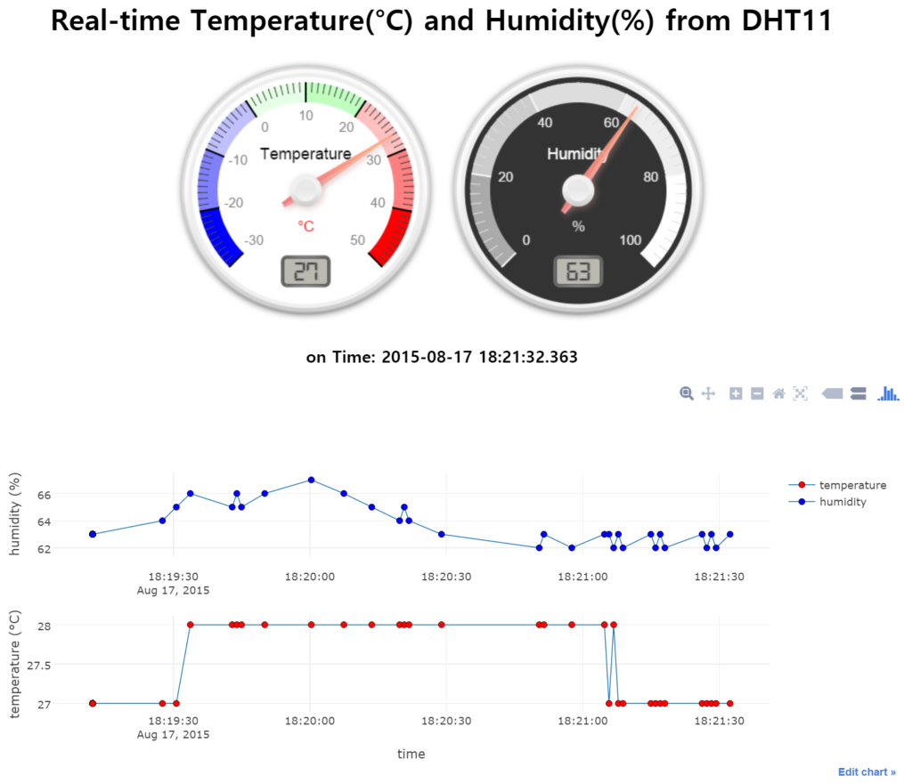
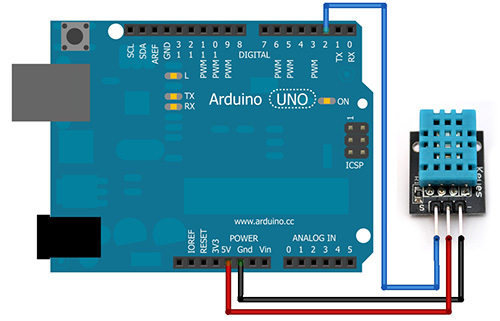
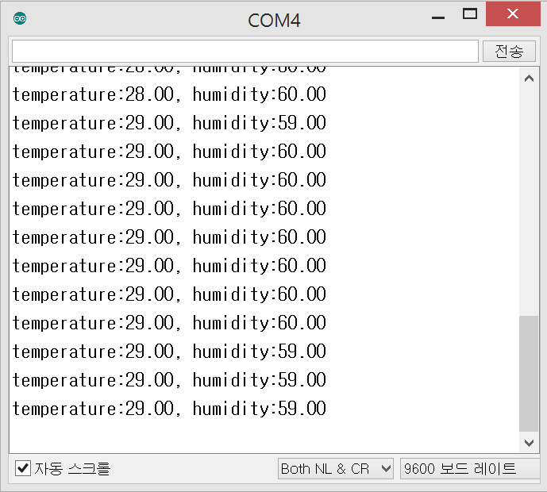
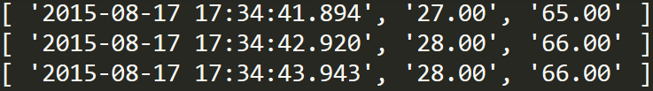

Arduino-dht11-nodejs-plotlyjs-streaming
===============================

## Use Node.js to monitor Arduino-DHT11 sensor circuit on web browser.

This repo introduces a simple and efficient way to plot the streaming data from DHT11 temparature and humidity sensor wired with Arduino. In the server side with node.js, data generated through serial port flow into the client side via server socket. In the client side, the streaming data are continuously received via client socket. By using **plotly-basic.js** we can easily plot the streaming data in real time.

## Snapshot of final result

 
For more figures, please look into the folder 'DHT11-snapshots'.

# The three steps to real time streaming
- Arduino-DHT11 sensor circuit and code
- Node server code using modules; serialport, socket.io
- Web client using plotly-basic.js, gauge.js ([canv-gauge](https://github.com/Mikhus/canv-gauge)), and socket.io.js

## [1] Arduino-DHT11 sensor circuit

Wiring between Arduino and DHT11 sensor is as follows; 

| Arduino | Easy Pulse sensor |
| ------- | ----------------- |
| 5V | VCC |
| GND | GND |
| D2 | DATA |

---

 

Figure from [ChiOSZ robots](http://chioszrobots.com/2013/07/15/dht11-digital-temperature-humidity-sensor-module-keyes/)

Arduino code is using [DHT11 library](https://github.com/RobTillaart/Arduino/tree/master/libraries/DHTlib) that should be installed in the subfolder "libraries" in Arduino folder. The default sampling frequency acquiring data is 1 Hz.

- Serial monitor (temp, humi)


[code: dht11_data.ino]
```ino
#include <DHT11.h>
int pin=2;  // digital pin number
DHT11 dht11(pin); // the subfolder "DHT11" in libraries folder of Arduino

void setup()
{
   Serial.begin(9600);
}

void loop()
{
  int err;
  float temp, humi;
  if((err=dht11.read(humi, temp))==0)
  {
    Serial.print("temperature:");
    Serial.print(temp);
    Serial.print(", humidity:");
    Serial.print(humi);
    Serial.println();
  }
  else
  {
    Serial.println();
    Serial.print("Error No :");
    Serial.print(err);
    Serial.println();    
  }
  delay(DHT11_RETRY_DELAY); //delay for reread = 1000 ms
}
```


## [2] Node server

Node.js code (data_dht11.js) parses the data string to store date, temperature and humidity in an array, and send the array to client via sockets.

[Running node server]

1. Install npm modules: `npm install`  // --- not necessary if installed already!
2. Run node code: `node data_dht11.js`

- Data format (Date, temp, humi)


[code: data_dht11.js]
``` js
var serialport = require('serialport');
var portName = 'COM4';  // change to your port.

var io = require('socket.io').listen(8000); // server listens for socket.io communication at port 8000

var sp = new serialport.SerialPort(portName,{
    baudRate: 9600,   // 9600  38400
    dataBits: 8,
    parity: 'none',
    stopBits: 1,
    flowControl: false,
    parser: serialport.parsers.readline("\r\n")
});

io.sockets.on('connection', function (socket) {
    // If socket.io receives message from the client browser then 
    // this call back will be executed.
    socket.on('message', function (msg) {
        console.log(msg);
    });
    // If a web browser disconnects from Socket.IO then this callback is called.
    socket.on('disconnect', function () {
        console.log('disconnected');
    });
});

var readData = '';  // this stores the buffer
var temp ='';
var humi ='';
var dht11data =[]; // this array stores date and data of temp, humi.

sp.on('data', function (data) { // call back when data is received
    readData += data.toString(); // append data to buffer
 
    if (readData.lastIndexOf(':') >= 20 && readData.indexOf(':') >= 0) {
        temp = readData.substring(readData.indexOf(':') + 1, readData.indexOf(','));
        humi = readData.substring(readData.lastIndexOf(':') + 1);
        readData = '';
        
        dStr = getDateString();
        dht11data[0]=dStr;  // Date
        dht11data[1]=temp;  // temperature data
        dht11data[2]=humi;  // humidity data
        console.log(dht11data);
        io.sockets.emit('message', dht11data);  // send data to all clients 

    } else {  // error 
        console.log(readData);
    }
    
});

// helper function to get a nicely formatted date string
function getDateString() {
    var time = new Date().getTime();
    // 32400000 is (GMT+9 Korea, GimHae)
    // for your timezone just multiply +/-GMT by 3600000
    var datestr = new Date(time +32400000).toISOString().replace(/T/, ' ').replace(/Z/, '');
    return datestr;
}

```


## [3] Web client

Web client (client_dht11.html) uses plotly-basic.js as well as four javascript libraries, d3, jquery, socket.io, and gauge. When the first set of signals arrives from server, the init() function draws the starting screen with a set of date and data. Whenever each signal that is differnet from the previous one arrives, nextPt() redraws screen using three array buffers, xArray for date, xTrack for temperature, and yTrack for humidity ([ref. plotly streaming data](https://plot.ly/javascript-graphing-library/streaming-data/)).

[code: client_dht11.html]
``` html
<!DOCTYPE html> 
<head>  
  <meta charset="utf-8">
  <title>plotly-basic.js Example: Real time DHT11</title>
  
  <!-- D3.js -->
  <script src="https://cdnjs.cloudflare.com/ajax/libs/d3/3.5.6/d3.min.js"></script>
  <!-- jQuery -->  
  <script src="https://code.jquery.com/jquery-2.1.4.min.js"></script>
  <!-- Plotly.js -->   
  <script src="https://d14fo0winaifog.cloudfront.net/plotly-basic.js"></script>
  <script type="text/javascript" src="https://cdnjs.cloudflare.com/ajax/libs/socket.io/1.3.6/socket.io.js"></script>
  <script src="gauge.min.js"></script>
  
  <style>body{padding:0;margin:30;background:#fff}</style>

</head>

<body>  <!-- style="width:100%;height:100%"> -->

<!-- Plotly chart will be drawn inside this DIV -->
<h1 align="center"> Real-time Temperature(°C) and Humidity(%) from DHT11 </h1>

    <!-- 1st gauge -->
    <div align="center">
    <canvas id="gauge1"> </canvas>
    
    <!-- 2nd gauge -->
    <canvas id="gauge2"> </canvas>
    </div>
    <!-- <div id="console"> </div> -->
<h3 align="center"> on Time: <span id="time"> </span> </h3> 

<div id="myDiv"></div>
<hr>

  <script>
  /* JAVASCRIPT CODE GOES HERE */
    var streamPlot = document.getElementById('myDiv');
    var ctime = document.getElementById('time');
    /*var streamToggle = document.getElementById('streamtoggle');
*/
    var xArray = [], // time of data arrival
        xTrack = [], // value of sensor 1 : temperature
        yTrack = [], // value of sensor 2 : humidity
        numPts = 100, // number of data points in x-axis                
        dtda = [],  // 1 x 3 array : [date, data1, data2] from DHT11
        preX = -1,
        preY = -1,
        initFlag = true;

    var socket = io.connect('http://localhost:8000'); // e319   
    socket.on('connect', function () {
        socket.on('message', function (msg) {
            // initial plot
            if(msg[0]!='' && initFlag){
                dtda[0]=msg[0];
                dtda[1]=parseInt(msg[1]);  // temperature
                dtda[2]=parseInt(msg[2]);  // humidity
                init();
                initFlag=false;
            }
            console.log(msg[0]);
            console.log(parseInt(msg[1]) + ', ' + parseInt(msg[2]));
            // Convert value to integer
            dtda[0]=msg[0];
            dtda[1] = parseInt(msg[1]); 
            dtda[2] = parseInt(msg[2]);

            // Only when any of temperature or humidity is different from the previous one, the screen is redrawed.
            if (dtda[1] != preX || dtda[2] != preY) {  // any change?
                preX = dtda[1];  
                preY = dtda[2];
                
                gauge_temp.setValue(dtda[1]);  
                gauge_humi.setValue(dtda[2]);  
                ctime.innerHTML = dtda[0];
                nextPt();
            }
                                
        });
    }); 

    function init() {  // initial screen ()
        // starting point : first data (temp, humi)
        for ( i = 0; i < numPts; i++) {
            xArray.push(dtda[0]);  // date 
            xTrack.push(dtda[1]);  // sensor 1 (temp)
            yTrack.push(dtda[2]);  // sensor 2 (humi)
        }

        Plotly.plot(streamPlot, data, layout);
    }
    
    function nextPt() {

        xArray.shift();
        xArray.push(dtda[0]);

        //newX = hn[0];
        xTrack.shift();
        xTrack.push(dtda[1]);  // sensor 1
        yTrack.shift();
        yTrack.push(dtda[2]);  // sensor 2

        Plotly.redraw(streamPlot);  
    }       

    // data
    var data = [{
        x : xArray,
        y : xTrack,
        name : 'temperature',
        mode: "markers+lines",  // "lines+markers"
        line: {
            color: "#1f77b4", 
            width: 1
         }, 
        marker: {
            color: "rgb(255, 0, 0)", 
            size: 6, 
            line: {
              color: "black", 
              width: 0.5
            }
         }
    }, {
        x : xArray,
        y : yTrack,
        name : 'humidity',
        xaxis: 'x2',
        yaxis : 'y2',
        mode: "markers+lines",  // "lines+markers"
        line: {
            color: "#1f77b4", 
            width: 1
         }, 
        marker: {
            color: "rgb(0, 0, 255)", 
            size: 6, 
            line: {
              color: "black", 
              width: 0.5
            }
         }
    }];

    var layout = {
        xaxis : {
            title : 'time',
            domain : [0, 1]
        },
        yaxis : {
            title : 'temperature (°C)',
            domain : [0, 0.4],
            range : [-30, 50]
        },
        xaxis2 : {
            title : '',
            domain : [0, 1],
            position : 0.6
        },
        yaxis2 : {
            title : 'humidity (%)',
            domain : [0.65, 1],
            range : [0, 100]
        }
    };

    alert("Realtime temperature and humidity streaming launched!");

    // gauge configuration
    var gauge_temp = new Gauge({
        renderTo    : 'gauge1',
        width       : 300,
        height      : 300,
        glow        : true,
        units       : '°C',
        valueFormat : { int : 2, dec : 0 },
        title       : "Temperature",
        minValue    : -30,
        maxValue    : 50,
        majorTicks  : ['-30','-20','-10','0','10','20','30','40','50'],
        minorTicks  : 10,
        strokeTicks : false,
        highlights  : [
            { from : -30,   to : -20, color : 'rgba(0, 0, 255, 1)' },
            { from : -20,   to : -10, color : 'rgba(0, 0, 255, .5)' },
            { from : -10, to : 0, color : 'rgba(0, 0, 255, .25)' },
            { from : 0,   to : 10, color : 'rgba(0, 255, 0, .1)' },
            { from : 10, to : 20, color : 'rgba(0, 255, 0, .25)' },
            { from : 20, to : 30, color : 'rgba(255, 0,  0, .25)' },
            { from : 30, to : 40, color : 'rgba(255, 0,  0, .5)' },
            { from : 40, to : 50, color : 'rgba(255, 0,  0, 1)' }
        ],
        colors      : {
            plate      : '#fff',
            majorTicks : '#000',
            minorTicks : '#444',
            title      : '#000',
            units      : '#f00',
            numbers    : '#777',
            needle     : { start : 'rgba(240, 128, 128, 1)', end : 'rgba(255, 160, 122, .9)' }
        }
    });

    gauge_temp.draw();

    var gauge_humi = new Gauge({
        renderTo    : 'gauge2',
        width       : 300,
        height      : 300,
        glow        : true,
        units       : '%',
        valueFormat : { int : 2, dec : 0 },
        title       : "Humidity",
        minValue    : 0,
        maxValue    : 100,  // new
        majorTicks  : ['0','20','40','60','80','100'],
        minorTicks  : 10,
        strokeTicks : false,
        highlights  : [
            { from : 0,   to : 20, color : '#aaa' },
            { from : 20, to : 40, color : '#ccc' },
            { from : 40, to : 60, color : '#ddd' },
            { from : 60, to : 80, color : '#eee' },
            { from : 80, to : 100, color : '#fff' }
        ],
        colors      : {
            plate      : '#333',
            majorTicks : '#f5f5f5',
            minorTicks : '#ddd',
            title      : '#fff',
            units      : '#ccc',
            numbers    : '#eee',
            needle     : { start : 'rgba(240, 128, 128, 1)', end : 'rgba(255, 160, 122, .9)' }
        }
    });

    gauge_humi.draw();

  </script>
</body>
</html>
```

***

Go to : [plotly-basic.js 2-dimensional streaming Example](./PlotlyJS_2dim_stremaing_returnmap/README_2dim_streaming.md)